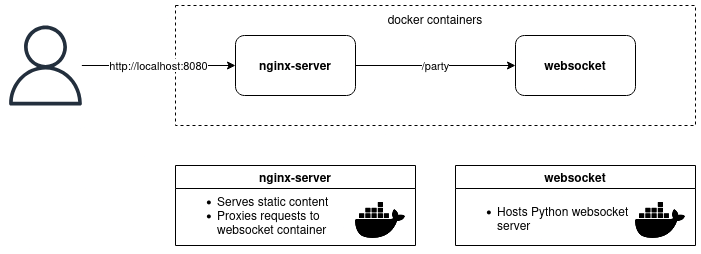

# Cursorparty
## Description
Cursorparty is a containerized novelty.

## Why?
Cursors need to get out more. Cursorparty is a safe and friendly environment where your cursor can hang out with other cursors!

## Installation
1. `sudo docker compose up --build`
2. [localhost:8080](http://localhost:8080/)

## Current Architecture

## Goals
 - Make something fun and quirky
 - Actually learn and implement something with Docker
    - Dockerfiles
    - Networking
    - Compose
 - Implement something with Websockets
 - Write some HTML, CSS, Javascript, and Python